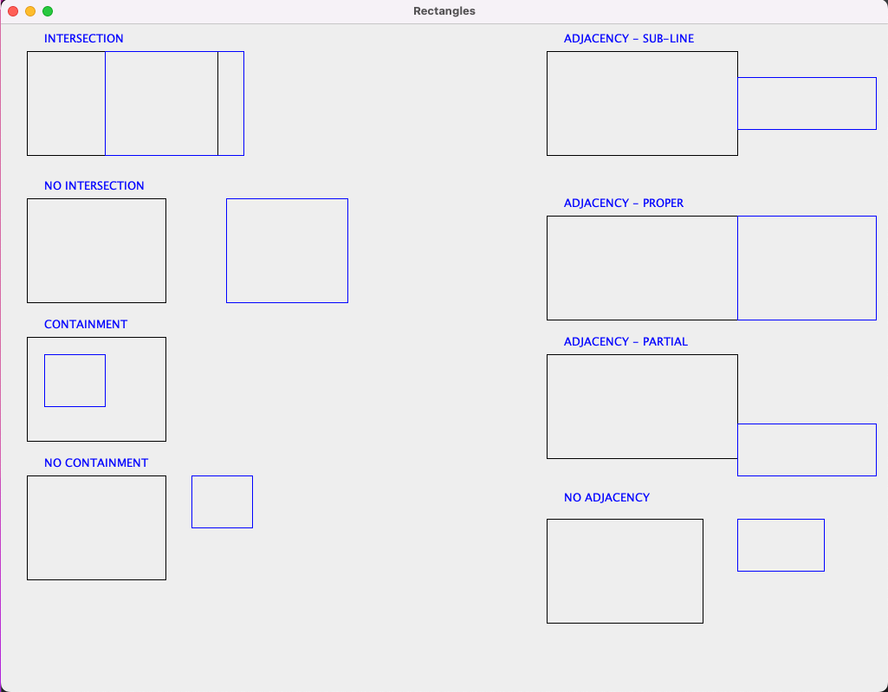

# Rectangles

# Install dependencies

- Java 21 Amazon Corretto.
- Gradle 8.5.

# Run the project

- This is a spring boot project, so you can run it as a spring boot application.
- When the application is running, you should see a Jframe Panel with the rectangles, like this:

- All the Rectangle logic is in the class `RectanglesService.java` in the package `com.rectangles.rectangles.services`.
- You can run the tests with the command `./gradlew test` in the root of the project.

## Problem Description:

You are required to write code in Java implementing certain algorithms that analyze rectangles and features that exist 
among rectangles. Your implementation is required to cover the following:

1. **Intersection:** You must be able to determine whether two rectangles have one or more intersecting lines and
                     produce a result identifying the points of intersection.
2. **Containment:** You must be able to determine whether a rectangle is wholly contained within another rectangle.
3. **Adjacency:** Implement the ability to detect whether two rectangles are adjacent. Adjacency is defined as the
                  sharing of at least one side. Side sharing may be proper, sub-line or partial. 
                  A sub-line share is a share where one side of rectangle A is a line that exists as a set of points
                  wholly contained on some other side of rectangle B, where partial is one where some line segment on
                  a side of rectangle A exists as a set of points on some side of Rectangle B. 
